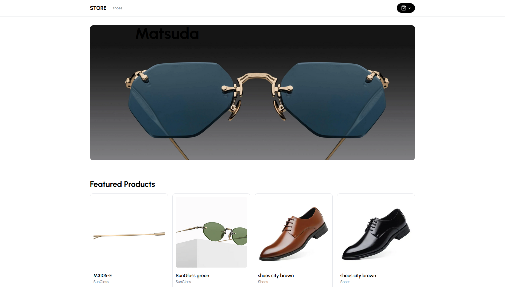
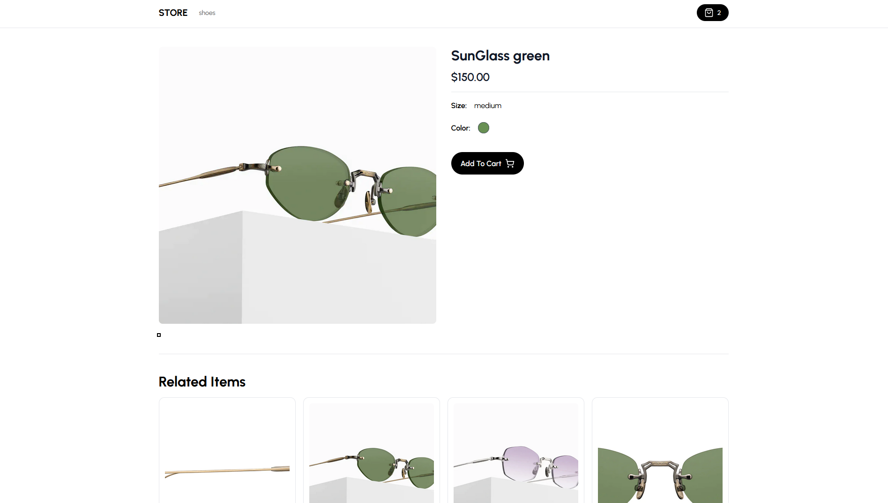
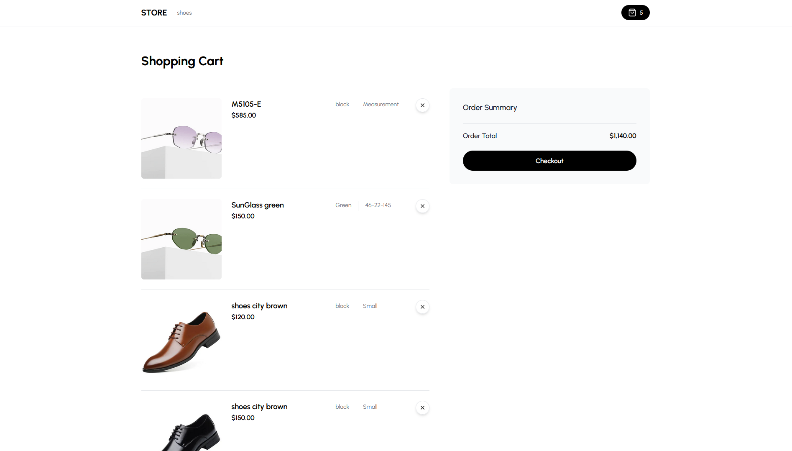

# Matsuda-store 🇬🇧

<kbd></kbd>

<kbd></kbd>

<kbd></kbd>

### Recommanded IDE

* [Visual Studio code](https://code.visualstudio.com/)

### Prerequisites

* [Git](https://git-scm.com/) to clone repositories
* [nodeJS](https://nodejs.org/fr/)(version 14.x) 
* [npm](https://www.npmjs.com/) to run application

### Dependances

*  [React](https://react.dev/learn)(version 18.2) 
*  [NextJs](https://nextjs.org/)(version 13.4) 
*  [Tailwind](https://tailwindui.com/)(version 3.3.2)  
*  [Typescript](https://reactdatepicker.com/)(version 5.1.6)   
*  [Shadcn-ui](https://react-select.com/home#getting-started)(version 14.x)      
*  [Stripe](https://reactdatepicker.com/)(version 14.x)                               
*  [Clerk](https://react-table-v7.tanstack.com/docs/examples/editable-data)(version 4.21)             
*  [Prisma](https://react-table-v7.tanstack.com/docs/examples/editable-data)(version 4.16.2) 
*  [Planetscale](https://www.npmjs.com/package/andyrama-modal)(version 14.x)
*  [Cloudinary](https://cloudinary.com)(version 4.14.1)
   
## Key Features:

- We will be using Shadcn UI for the Admin!
- Our admin dashboard is going to serve as both CMS, Admin and API!
- You will be able to control mulitple vendors / stores through this single CMS! (For example you can have a "Shoe store" and a "Laptop store" and a  "Suit store", and our CMS will generate API routes for all of those individually!)
- You will be able to create, update and delete categories!
- You will be able to create, update and delete products!
- You will be able to upload multiple images for products, and change them whenever you want!
- You will be able to create, update and delete filters such as "Color" and "Size", and then match them in the "Product" creation form.
- You will be able to create, update and delete "Billboards" which are these big texts on top of the page. You will be able to attach them to a single category, or use them standalone (Our Admin generates API for all of those cases!)
- You will be able to Search through all categories, products, sizes, colors, billboards with included pagination!
- You will be able to control which products are "featured" so they show on the homepage!
- You will be able to see your orders, sales, etc.
- You will be able to see graphs of your revenue etc.
- You will learn Clerk Authentication!
- Order creation
- Stripe checkout
- Stripe webhooks
- MySQL + Prisma + PlanetScale

### Installing and launching backend-end

```shell
git clone https://github.com/AndyRama/ecommerce-store.git
```

- [x] Clone the repository: `gh repo clone AndyRama/ecommerce-store`
- [x] Move to this folder: `ecommerce-store`
- [x] Install dependencies: `npm install`
- [x] Launch application: `npm run dev`

```bash
Front-end is now rendered at URL http://localhost:3001
```

### Setup .env file

```js
NEXT_PUBLIC_API_URL=
```

### Start the app

```shell
npm run dev
```

## Available commands

Running commands with npm `npm run [command]`

| command         | description                              |
| :-------------- | :--------------------------------------- |
| `dev`           | Starts a development instance of the app |